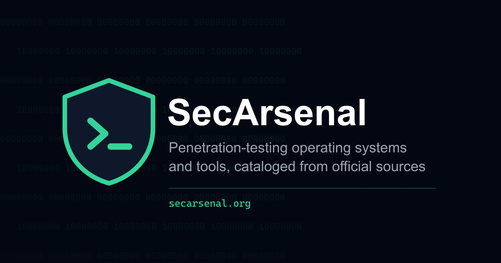

<p align="center">
  
</p>

<p align="center">
  <a href="https://github.com/brando5393/secarsenal/actions/workflows/ci.yml"></a>
  <a href="./LICENSE"></a>
  <a href="./LICENSE-CONTENT"></a>
  <a href="https://secarsenal.org"></a>
</p>

# SecArsenal

A searchable reference for infosec professionals: pentesting operating
systems (Kali, Parrot, BlackArch, ...) and individual tools, what they
are, what they're for, brief getting-started notes, and links straight
to the official docs and download pages. Educational and informational
only; see [`/disclaimer`](./src/pages/disclaimer.astro).

**[secarsenal.org](https://secarsenal.org)**

## Getting started

```bash
npm install
npm run dev       # local dev server
npm run build     # production build + Pagefind index
npm run preview   # serve the production build locally
npm run check-links   # verify every content entry's URLs are reachable
                       # and flag entries not verified in 180+ days
```

Requires Node >= 22.12 (see `engines` in `package.json`).

## Stack

- **Astro** (static output, no server runtime; see `astro.config.mjs`).
- **Tailwind CSS v3** with **Material Tailwind**'s HTML/utility-class
  patterns for styling (`tailwind.config.cjs`, `postcss.config.cjs`,
  `src/styles/global.css`). No React; Material Tailwind's HTML flavor
  is just documented Tailwind class conventions, which keeps the site
  framework-free.
- **Content collections** (`src/content.config.ts`) for the `os` and
  `tools` datasets, validated with Zod at build time.
- **Pagefind** for static, client-side full-text search (indexed as a
  `postbuild` step, only available after `npm run build`, not in
  `dev`), scoped to real content via `data-pagefind-body`, weighted so
  exact-name matches rank first, and filterable by `type`/`category`/
  `team`/`platform`/`commonly-on`. [`/rss.xml`](./src/pages/rss.xml.ts)
  covers just the OS collection; tools are bulk-synced monthly, so a
  feed entry per tool would be noise.
- All client-side interactivity lives in one plain-JS file,
  `public/scripts/site.js` (plus `public/scripts/a11y.js` for the
  accessibility panel). See `SECURITY.md`'s "Client-side scripts and
  CSP" section for why: the site's CSP blocks Astro's default
  inline-script bundling.
- JSON-LD structured data via a `structuredData` prop on
  `BaseLayout.astro`: `SoftwareApplication` on every OS/tool page,
  `WebSite` with a `SearchAction` on the homepage, `CollectionPage` on
  every index/category/browse page, and `BreadcrumbList` generated
  from the same `items` prop the visible breadcrumb nav renders, so
  the two can't drift apart.
- A hand-judged `team: 'red' | 'blue'` field on OS entries (see
  `src/content.config.ts`'s comment for why there's deliberately no
  `purple`), and a best-effort equivalent for tools derived at render
  time from each tool's categories (`src/lib/toolTeam.ts`). Both are
  UI-only filters, not sourced from any upstream taxonomy. Sourced
  definitions for both live at `/categories#team-classification`.
- `src/lib/attackTactics.ts` links a tool's category to the matching
  official MITRE ATT&CK tactic page when the category string is an
  exact match to one of the 14 ATT&CK Enterprise tactic names.
- Crawlable, filterable pages beyond the two collection indexes:
  `/os/category/<category>` and `/tools/category/<category>`,
  `/tools/goals` (a plain-language regrouping of the same category
  data), and `/data-freshness` (per-source sync counts and staleness,
  computed live from the content collections).
- A first-party accessibility panel (`public/scripts/a11y.js`, markup
  in `BaseLayout.astro`): larger text, extra spacing, high contrast,
  always-underline links, a stronger focus outline, and reduced
  motion, each toggleable and persisted in `localStorage`. Real
  CSS/JS in this codebase, not a third-party overlay-widget script.
- [`/changelog`](./src/pages/changelog.astro), a real, per-month
  added/removed digest computed from git history at build time. Tools
  only ever get Added/Removed counts, never "Updated," since every
  monthly sync re-stamps `lastVerified` on every tool it touches
  regardless of real change, and a raw diff count would just report
  the whole catalog as "updated" every month.
- Print styles (`src/styles/global.css`'s `@media print` block): an
  OS/tool page is genuinely useful printed, with a light background,
  no interactive/navigational chrome, and external links expanded to
  their real URLs since they can't be clicked on paper.

## Content model

The two collections are sourced very differently:

- **`src/content/tools/`** is entirely **generated**, from eleven
  official sources, in priority order (an earlier source always wins
  when the same tool appears in more than one):

  | # | Source | Coverage |
  |---|---|---|
  | 1 | [Kali's tool pages](https://www.kali.org/tools/all-tools/) | 779 tools |
  | 2 | [BlackArch's tool table](https://blackarch.org/tools.html) | ~2,500 more |
  | 3 | [REMnux docs](https://docs.remnux.org/discover-the-tools/analyze+documents) | ~195 more |
  | 4 | [Tails' included software](https://tails.net/doc/about/features/index.en.html) | ~19 more |
  | 5 | [Security Onion docs](https://docs.securityonion.net/en/2.4/tools.html) | ~10 more |
  | 6 | [ArchStrike's package table](https://archstrike.org/packages) | ~400 more |
  | 7 | [FLARE VM's package list](https://github.com/mandiant/flare-vm/blob/main/config.xml) | ~90 more |
  | 8 | [T-Pot's README](https://github.com/telekom-security/tpotce#honeypots-and-tools) | ~30 more |
  | 9 | [OSINT Framework](https://github.com/lockfale/OSINT-Framework) | 695 more |
  | 10 | [Exegol's tool CSVs](https://github.com/ThePorgs/Exegol) | 190 more |
  | 11 | [Kali NetHunter App Store](https://store.nethunter.com/repo/) | 26 more |

  A few sourcing notes worth knowing before touching any of this:
  - **BlackArch** has real link rot in its homepage column (~10-15%
    dead on a full check), so this sync verifies each one and omits
    `downloadUrl` rather than publish a dead link; `docsUrl` is
    unaffected either way.
  - **ArchStrike**'s table has no homepage/category columns, so this
    sync fetches each package's `PKGBUILD` from ArchStrike's GitHub for
    its `url=` and `groups=` fields, skipping ArchStrike's own
    infrastructure/branding packages.
  - **FLARE VM**'s real content lives in Mandiant's `.vm`-namespaced
    package repo, cleanly separable from CommandoVM's install profile
    (which mixes that namespace with unfilterable generic Chocolatey
    packages, and was rejected as a sync source for that reason).
  - **OSINT Framework**, **Exegol**, and **Kali NetHunter App Store**
    aren't a specific distro's bundled list, so their entries get
    `commonlyOn: []`. Exegol and NetHunter also introduce
    `platforms: ["Linux"]` and `["Android"]` respectively, genuinely
    new territory for the catalog: real installed software, not a
    browser-based OSINT resource.
  - **Exegol**'s per-tool CSV carries no category field, so this sync
    derives one from which of Exegol's `ad`/`web`/`osint`/`light`
    image variants a tool ships in, falling back to `"general"`.

  Each sync tracks the slugs it owns in its own manifest
  (`scripts/manifests/*.json`) and only ever deletes files it
  previously created, so the sources can't clobber each other.
  **Don't hand-edit files in `src/content/tools/`**; the next sync
  overwrites them. Fix a bad entry by fixing the relevant sync script.
  Categories are free-form strings taken directly from each source's
  own taxonomy, not a hardcoded enum, so this collection never needs
  manual updates to stay in sync.

  Adding another source means writing a new
  `scripts/sync-<name>-tools.mjs` following the same manifest pattern,
  but check first that the OS actually publishes something scrapable.
  (Parrot Security OS doesn't: its docs point to upstream `man` pages
  instead of maintaining a list.)

- **`src/content/os/`** stays **hand-curated**. There's no single
  official index of "all pentest operating systems" the way Kali
  indexes its own tools. Add a Markdown file under `src/content/os/`
  matching the schema in `src/content.config.ts`; every entry needs
  `lastVerified` (the date you personally confirmed the URLs/details),
  `docsUrl`, and `downloadUrl`/`repoUrl` where applicable. The
  Markdown body is the page's main description; `gettingStarted` is a
  short plain-text blurb. `team` (`red`/`blue`, no `purple`, see
  `src/content.config.ts`'s comment) is optional: a hand judgment
  based on the distro's actual nature (see the `review-os-candidates`
  skill), left unset for entries that aren't a security-team tool at
  all (privacy/opsec OSes like Tails or Whonix, general rescue distros
  like SystemRescue).

## Content freshness

- **Tools:** each `npm run sync-tools*` command re-fetches and
  regenerates its share of the collection.
  [`sync-tools.yml`](.github/workflows/sync-tools.yml) runs all
  eleven, in priority order, monthly, and opens a PR with the diff.
  Never straight to `master`, so a parsing bug or a page-structure
  change gets caught in review, not published.
- **OS entries:** `npm run check-links` checks every URL for
  reachability and flags anything not verified in 180+ days.
  [`freshness-check.yml`](.github/workflows/freshness-check.yml) runs
  this weekly and opens an issue.
- **Distros without a syncable tool list** (Parrot, CAINE, Pentoo, and
  most distros drafted from the Rawsec discovery pipeline) have no
  official, structured, per-tool listing upstream. Their
  `notableTools` are hand-maintained and marked
  `toolListMaintenance: manual`, which the site surfaces as a visible
  warning, the default for any newly added entry, so nothing is ever
  silently presented as auto-verified.
- **Discovering new OS candidates:**
  [`discover-os.yml`](.github/workflows/discover-os.yml) checks
  [Rawsec's CyberSecurity Inventory](https://github.com/noraj/rawsec-cybersecurity-inventory)
  monthly for distros not already in `src/content/os/` and drafts a
  stub entry (clearly TODO-marked) for each. A human verifies the
  guessed fields and decides whether it belongs before merging. A
  candidate explicitly rejected during review is recorded in
  `scripts/manifests/discover-os-rejected.json` so it isn't redrafted
  every month.

None of the above runs a live backend. They're scheduled, one-shot
jobs that commit/PR static files, keeping the deployed site itself
100% static. [`ci.yml`](.github/workflows/ci.yml) runs on every
push/PR (build + `npm audit`) so a broken build is caught before
merge, not by a monthly/weekly schedule.

## Security

See [`SECURITY.md`](./SECURITY.md) for the site's security model,
header configuration, and how to report a vulnerability.

## License

Code is licensed under [MIT](./LICENSE). Content under `src/content/`
(the OS and tool write-ups) is licensed under
[CC BY 4.0](./LICENSE-CONTENT).

## Deployment

Live on **AWS Amplify Hosting**, connected to this repo's `master`
branch: every push builds and deploys automatically, no manual step.
Also reachable at Amplify's default domain,
`https://master.d68esdk03yoqv.amplifyapp.com`.

`secarsenal.org` is registered through **Cloudflare Registrar** and
pointed at this Amplify app via CNAME, keeping hosting on AWS as-is.
DNS lives on Cloudflare, not Route 53: three DNS-only CNAME records
for the apex, `www`, and Amplify's ACM validation record. Cloudflare
can't literally serve a CNAME at the zone apex per spec, so it
flattens that record to CloudFront's real addresses at resolve time;
Amplify's domain-status check accepts this, even though the
per-subdomain detail for the apex can show `verified: false`
(cosmetic, not a sign anything's broken). A Cloudflare Workers
migration was scoped as a fallback (`wrangler.jsonc` in the repo root)
but isn't the active plan.

Response headers (`SECURITY.md`) are set via `customHttp.yml`, which
Amplify reads automatically on every build. Redirects (the
`/<*> → /404.html` fallback) aren't git-managed. Amplify has no
repo-file equivalent, so that rule lives only in the console (Hosting
→ Rewrites and redirects) and would need re-adding if the app were
ever recreated.

## Public MCP server

[`/catalog.json`](./src/pages/catalog.json.ts) is a public JSON export
of both collections; anyone can consume it directly.

[`mcp-server/`](./mcp-server) is a separate
[MCP](https://modelcontextprotocol.io) server, deployed as its own
Cloudflare Worker at `mcp.secarsenal.org/mcp`, so Claude or any other
MCP client can query the catalog without scraping rendered pages. It
polls `/catalog.json` on an hourly cron and caches the result in
Workers KV, so tool calls never touch this site's origin directly.
Tools exposed: `search_tools`, `get_tool`, `search_os`, `get_os`,
`list_categories`. All read-only, no auth. The route is rate-limited
at the Cloudflare edge since it's open to the public internet. See
[`mcp-server/README.md`](./mcp-server/README.md) for the full data
flow and deploy process, or the live
[`/mcp`](./src/pages/mcp.astro) page for a client config snippet and
the tool list in plain prose.
